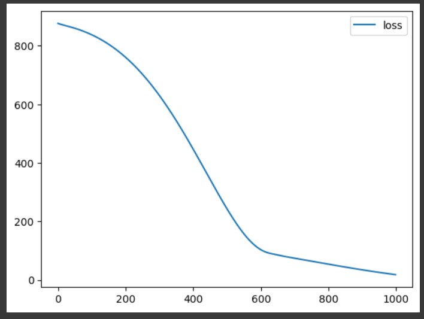

# Developing a Neural Network Regression Model

## AIM

To develop a neural network regression model for the given dataset.

## THEORY

Neural networks can be used for regression tasks by learning a complex mapping between input features and a continuous target variable.The network is made up of interconnected layers of artificial neurons, inspired by the structure of the biological brain.Each neuron performs a weighted sum of its inputs and applies an activation function to introduce non-linearity.

 The Neural network model is made up of of 1 Input layer,1 Output layer and 3 Hidden layers.The Input and Hidden layers has 'relu' activation in the neurons.All the layers are Dense layers.Input layer is made up of 1 neuron.The first hidden layer consists of 7 neurons,second consists of 12 and last consists of 5 layers.The output layer has 1 neuron.The model is compiled with 'rmsprop' optimizer and 'mse' loss function.Using these features the predicted value is calculated.

## Neural Network Model


## DESIGN STEPS

### STEP 1:

Loading the dataset

### STEP 2:

Split the dataset into training and testing

### STEP 3:

Create MinMaxScalar objects ,fit the model and transform the data.

### STEP 4:

Build the Neural Network Model and compile the model.

### STEP 5:

Train the model with the training data.

### STEP 6:

Plot the performance plot

### STEP 7:

Evaluate the model with the testing data.

## PROGRAM
### Name: Easwari M
### Register Number:212223240033
```
import pandas as pd

from sklearn.model_selection import train_test_split

from sklearn.preprocessing import MinMaxScaler

from tensorflow.keras.models import Sequential
from tensorflow.keras.layers import Dense

from google.colab import auth
import gspread
from google.auth import default

auth.authenticate_user()
creds, _ = default()
gc = gspread.authorize(creds)

worksheet = gc.open('CIA-1Marks').sheet1
data = worksheet.get_all_values()

dataset1 = pd.DataFrame(data[1:], columns=data[0])
dataset1 = dataset1.astype({'Scoredmarks':'int'})
dataset1 = dataset1.astype({'Percentage':'int'})

dataset1.head()

X = dataset1[['Scoredmarks']].values
y = dataset1[['Percentage']].values

X

X_train,X_test,y_train,y_test = train_test_split(X,y,test_size = 0.44,random_state = 44)


Scaler = MinMaxScaler()

Scaler.fit(X_train)

X_train1 = Scaler.transform(X_train)


from tensorflow import keras
from tensorflow.keras import layers
model_1 = keras.Sequential([
    layers.Dense(units=7,activation='relu',input_shape=[1]),
    layers.Dense(units=12,activation='relu'),
    layers.Dense(units=5,activation='relu'),
    layers.Dense(units=1)
])

model_1.compile(optimizer = 'rmsprop',loss='mse')

odel_1.fit(X_train1,y_train,epochs=999)


loss_df = pd.DataFrame(model_1.history.history)


loss_df.plot()


X_test1 = Scaler.transform(X_test)


model_1.evaluate(X_test1,y_test)

X_n1 = [[30]]


X_n1_1 = Scaler.transform(X_n1)


model_1.predict(X_n1_1)

```
## Dataset Information


## OUTPUT

### Training Loss Vs Iteration Plot



### Test Data Root Mean Squared Error


### New Sample Data Prediction


## RESULT

A neural network regression model for the given dataset has been developed Successfully.
